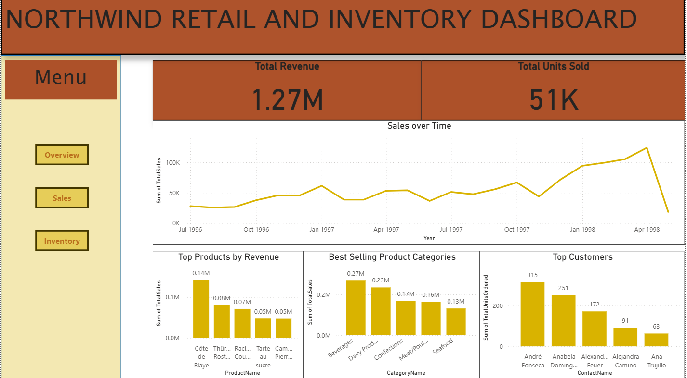

# Northwind Retail & Inventory Analytics

This project uses the **Northwind SQL Server sample database** to explore retail sales and inventory performance. I wrote SQL queries to analyze key business metrics, created reusable database views for common KPIs, and prepared the results for visualization in **Power BI**. View dashboard here:

---

## 📊 Project Objectives
- Practice **SQL Server** for real-world analytics  
- Analyze retail sales, inventory, and customer behavior  
- Create **reusable database views** for KPIs  
- Export results to **Power BI** for dashboarding  

---

## 🔧 Tools & Technologies
- Microsoft SQL Server & SSMS  
- T-SQL (queries, joins, views, aggregations)  
- Power BI (for visualization)  

---

## 📂 Key Queries & Views
- **Top Customers** – total sales revenue and units sold for customers 
- **Top Products and Categories** – using both revenue and units sold as metrics to rank top products and categories
- **Stock vs. Sales Ratio** – inventory compared to demand, per category  
- **Sales over time** – how has sales changed over the three year time period  

---

## 📈 Outputs
- Cleaned KPI views in SQL Server  
- Exported results for reporting  
- Interactive dashboard 

---

## 🚀 How to Run
1. Install SQL Server + SSMS  
2. Import the [Northwind Database](https://github.com/microsoft/sql-server-samples/tree/master/samples/databases/northwind-pubs)  
3. Run the SQL scripts to create views  
4. Query the views or connect them to Power BI/Excel for visualization  
